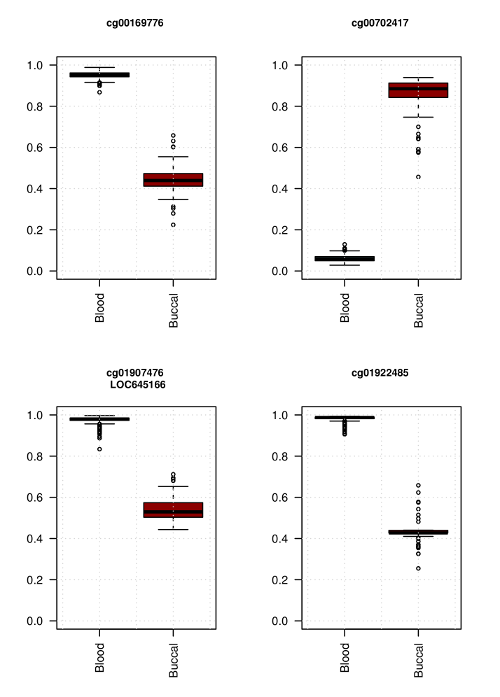

```{r setup, include=FALSE}
knitr::opts_chunk$set(echo = FALSE)
```

## Overview {.smaller}

`bootNet` is a wrapper for the fantastic glmnet^[1]^ `R` package  

  - it brings bootstrapping and parallel processing to an Elastic-net framework

<br>

Currently this script is set up to analyse methylation data in the form of beta matrices  

  - the beta matrix must have CpG sites as rows and samples as columns for `bootNet` to work

<br>

Future updates will allow analysis of various types of data, forming the basis of an <span style="color:darkred">**integrative omics**</span> approach

## Reasoning {.smaller}

  - analysis tools for methlyation data (especially 27k/450k/850k) are fairly limited
    + they are mostly inherited 'liftovers' from traditional expression analyses (i.e. `limma`) 
  - most methods are slow
    + dealing with half a million sites (nearly a million with new chip)
  - beta values are special ...
    + most don't fit normal distribution
    + bounded between $0 - 1$
  - no easy way to integrate layers of data
    
<br>

<div class="centered">
<span style="font-size:1.2em">**Can we create an analysis method that is <span style="color:darkred">robust</span> to both the outcome variable as well as the predictor variables, that is also <span style="color:darkred">fast</span> and could possibly be developed into an <span style="color:darkred">integrative</span> omics approach?**</span>
</div>

## Ridge-Regression {.smaller}

Ridge regression addresses some of the problems of Ordinary Least Squares (OLS) by imposing a penalty on the size of coefficients  

  - the Ridge coefficients minimise a penalised residual sum of squares
  - Ridge regression keeps all the variables in and shrinks the coefficients towards zero.

<br>

Ridge is doing:

  - shrinkage
  - but <span style="color:darkred">**not**</span> variable selection
  - dense model

In glmnet Ridge regression is selected by setting $\alpha = 0$ e.g. 
<span style="color:darkred">**$$fit.Ridge = glmnet(x, y , \alpha = 0)$$**</span>

## LASSO (Least Absolute Shrinkage and Selection Operator) {.smaller}

A regression analysis method that performs both variable selection and regularisation in order to enhance the prediction accuracy and interpretability of the statistical model it produces

<br>

LASSO is doing:

  - shrinkage
  - <span style="color:darkred">**and**</span> variable selection
  - sparse model

In glmnet LASSO is selected by setting $\alpha = 1$ *(this is also the default option)* eg. 
<span style="color:darkred">$$fit.LASSO = glmnet(x, y , \alpha = 1)$$</span>

## Ridge vs LASSO {.smaller}

  - <span style="color:darkred">**in science / statistics, there is no rule that means that you should always use one technique over another**</span> 
    + situation dependent model selection
  
<br>

  - the LASSO encourages sparse models, whereas with Ridge you’ll get a dense model 
    + <span style="font-size:0.75em">if the *‘true model’* is quite dense, you expect to do better with Ridge</span>
    + <span style="font-size:0.75em">if the *‘true model’* is quite sparse, you expect to do better with the LASSO</span> 

<br>

  - not knowing the *‘true model’*, it's typical to apply both methods and use cross-validation to determine the best model

--------------

<br>

<br>

<br>

<div class="centered">
<span style="font-size:2.6em">... or ... enter ...</span>
</div>

## Elastic-net {.smaller}

  - we now know that:
    + the Ridge penalty shrinks the coefficients of correlated predictors towards each other 
    + while the LASSO tends to pick one of them and discard the others  
    

  - the Elastic-net penalty mixes these two methods
    + if predictors are correlated in groups, an <span style="color:darkred">$\alpha=0.5$</span> tends to select the groups in or out together

<br>

  - Elastic-net is <span style="color:darkred">**useful**</span> when there are <span style="color:darkred">**multiple features**</span> which are <span style="color:darkred">**correlated**</span> with one another 
    + LASSO is likely to pick one of these at random, while Elastic-net is likely to pick both

<br>

<div class="centered">
<span style="font-size:0.95em">A practical advantage of trading-off between LASSO and Ridge is it allows Elastic-Net to inherit some of Ridge’s stability under rotation.</span>
<div>

## Elastic-net overcomes limitations {.smaller}

The Elastic-net helps overcome some of the limitations of Ridge and LASSO:

  - When $p > n$ (the number of covariates is greater than the sample size) LASSO can select only $n$ covariates
  - if there is <span style="color:darkred">**a group of highly correlated variables**</span>, then the <span style="color:darkred">**LASSO**</span> tends to <span style="color:darkred">**select one variable**</span> from a group and ignore the others (example of CpGs in methylation analysis, use of <span style="color:darkred">**LASSO results in no DMRs**</span>)
  - even when $n > p$, if the covariates are strongly correlated, Ridge regression tends to perform better
    + explaining why Elastic-net favoring $\alpha$ towards 0 (Ridge) results in the detection of DMRs when looking at 450K data
    + this is referred to as the grouping effect and is generally considered desirable since, in many applications, such <span style="color:darkred">**identifying genes associated with a disease, one would like to find all the associated covariates**</span>, rather than selecting only one from each set of strongly correlated covariates, as LASSO often does
  - selecting only a single covariate from each group will typically result in increased prediction error, since the model is less robust (which is why Ridge regression often outperforms LASSO)

## glmnet {.large}

<div class="centered">
> <span style="font-size:0.85em">*Extremely efficient procedures for fitting the entire LASSO or Elastic-net regularization path for linear regression, logistic and multinomial regression models, Poisson regression and the Cox model.* ^[1]^ </span> 

</div>

  - `glmnet` is an `R` package which can be used to fit Regression models, LASSO model and others
  - $\alpha$ argument determines what type of model is fit. 
    + when <span style="color:darkred">**$\alpha=0$, a Ridge model**</span> is fit 
    + and if <span style="color:darkred">**$\alpha=1$, a LASSO model**</span> is fit. 
  - super efficient/fast FORTRAN code (can analyse large data sets quickly)

<div class="centered">
<span style="font-size:0.8em">These methods are very powerful. In particular, they can be applied to very large data where the <span style="color:darkred">**number of variables might be in the thousands or even millions**</span> (in our case genomic data).</span>
</div>

## bootNet: what is it? {.smaller}

`bootNet` is a wrapper I wrote for `glmnet` to help <span style="color:darkred">**identify methylation sites**</span> (CpGs) which predict an outcome

  - the outcome can either be:
    + <span style="color:darkred">**quantitative**</span> (continuous, i.e. age, BMI, weight ... )
    + <span style="color:darkred">**qualitative**</span> (categorical, i.e. gender, smoking, case/control ... )
    
I integrated the ability to perform bootstrapping for a given number of iterations
 
  - user defined sub-sampling at each iteration
  - additional sampling approaches (i.e. 'leave one out')
  
Additionally, I wrote a second function to allow <span style="color:darkred">**parallisation**</span>
  
  - this allows a user to select the number of processors (cores) to split the task across
  - running on multiple cores greatly speeds up analysis (as we'll see later)

## The functions

### <span style="color:darkred">**bootNet()**</span>

  - bootstrap implementation of `glmnet` Elastic-net framework
```{r, echo=TRUE, eval=FALSE, tidy=TRUE}
bootNet(data = x, outcome = y, Alpha = 0.1, iter = 1000, sub_sample = 0.666, sampleID = sampleID)
```
<br>

### <span style="color:darkred">**bootNet.parallel()**</span>

  - a parallel version of the `bootNet` function to utalise multiple cores if available
```{r, echo=TRUE, eval=FALSE, tidy=TRUE}
bootNet.parallel(data = x, outcome = y, Alpha = 0.1, iter = 1000, sub_sample = 0.666, cores = 4, sampleID = sampleID)
```

## Example usage: {.smaller}

What do you need to provide the `bootNet` script?

  - <span style="color:darkred">***data***</span> - methylation beta matrix^**\***^ (formatted CpG sites as rows, samples as columns)
  - <span style="color:darkred">***outcome***</span> - either as numeric (quantitative trait) or as factor (qualitative trait)
  - <span style="color:darkred">***Alpha***</span> - sets the mixture between Ridge-regression and LASSO
  - <span style="color:darkred">***iter***</span> - the number of iterations to bootstrap
  - <span style="color:darkred">***sub_sample***</span> - percentage of sample/case-control groups to sub-sample for bootstrapping
  - <span style="color:darkred">***sampleID***</span> - a list of sample IDs (usually the column names of the beta matrix). These MUST be in the same order as the samples in the beta matrix
  - <span style="color:darkred">***cores***</span> - number of cores to use for bootNet.parallel

<br>

^**\***^ future versions of `bootNet` will be able to analyse many different types of data (i.e. SNP, expression, phenotypic, ...)

## In action {.smaller .columns-2}


<div>
Example data set: whole blood vs bucal cells

  - **656** whole blood methylomes
  - **75** bucal methylomes
  - **2500** iterations
    - **66.66%** subsampling
  - provided $\alpha = 0.1$
  
  <br>
  
  - <span style="color:darkred">**identified 27 CpG**</span> sites 100% of the time
    + each of these sites came through every iteration
    + perfect discriminators
</div>

<div>

</div>

## Performance {.smaller}

A few test examples showing systems and performance metrics

**Experiment 1:** 24 samples run on Illumina 450K methylation array (**24 columns, 446280 rows**). Phenotype was quantitative (age)

  - System used (Dell laptop: Precision M4800):
    + Intel Core i7-4900MQ (4 core, 8 threads)
    + 32GB DDR3
    + 256GB SSD
    + Linux - 4.3.0-towo.3-siduction-amd64 x86_64 (64 bit)
  
  - Running <span style="color:darkred">**100 iterations**</span> and using **4 cores** the maximum observed RAM usage was **20GB**, taking <span style="color:darkred">**85.6 seconds**</span> or (1.4 minutes)

## Performance {.smaller}

A few test examples showing systems and performance metrics

**Experiment 2:** 75 samples run on Illumina 450K methylation array (**75 columns, 445998 rows**). Phenotype was quantitative (glucose)

  - System used (Dell workstation):
    + Intel Xeon E5-2620 (6 cores, 12 threads)
    + 128GB DDR3
    + 256GB SSD
    + Linux - Debian Sid (64 bit)

  - Running **100 iterations** and using **10 cores** the maximum observed RAM usage was **30GB**, taking **120.9 seconds** (or 2 minutes)
  - Running the above at <span style="color:darkred">**1000 iterations**</span> and using **10 cores** the maximum observed RAM usage was **30GB**, taking <span style="color:darkred">**1152.8 seconds**</span> (or 19.2 minutes)
  - Running the above at **5000 iterations** and using **10 cores** the maximum observed RAM usage was **30GB**, taking **5718.8 seconds** (or 1.5 hours)

## To do list {.smaller}

  - add example data set and a decent tutorial
  - include additional quality checks
    + ~~ensure outcome is either numeric or factor~~
    + check for missing data (NAs) in both data and outcome
  - explore bias estimation and performance of selected markers
  - implement a double-bootstrap method as an additional way to explore performance metrics
    + separate training and test data
    + bootstrap both data sets
    + compare selected sites
  - look into AUC and ROC as another form of marker selection/validation
  - add an argument to perform "leave one out" analysis (replaces sub-sampling)
  - write up as manuscript
    + <span style="color:darkred">**bootNet: identifying robust classifiers in methylation data**</span>

## References {.smaller}

^1^ Jerome Friedman, Trevor Hastie, Robert Tibshirani (2010). Regularization Paths for Generalized Linear Models via
  Coordinate Descent. Journal of Statistical Software, 33(1), 1-22. URL http://www.jstatsoft.org/v33/i01/

<br>
<br>

### Getting a copy
`bootNet` is currently housed in a private Github repository (https://github.com/sirselim/bootNet) and will be made publicly available upon publication. If you would like to try it out please feel free to contact me directly: m.benton@qut.edu.au
